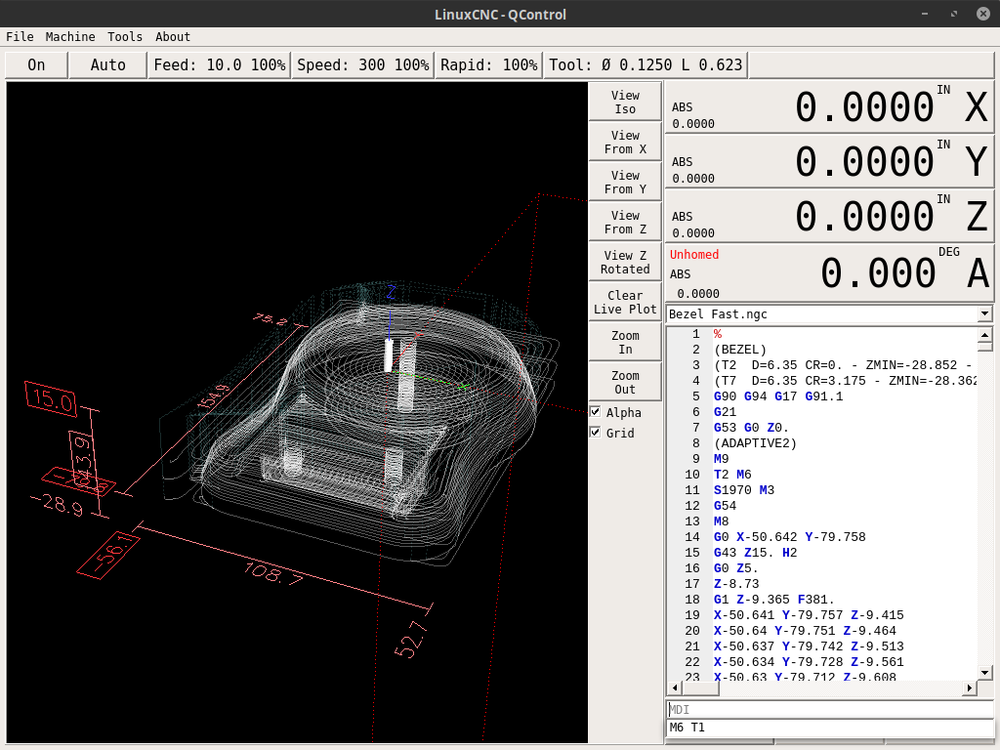

# QControl

A QtPyVCP based Virtual Control Panel for LinuxCNC




## Installing via pip

To intall the latest version:  

`pip install git+https://github.com/KurtJacobson/qcontrol.git`


Development install from localy cloned source:  

`pip install -e .`


## INI File Setup

```ini
[DISPLAY]
DISPLAY = qcontrol
```
